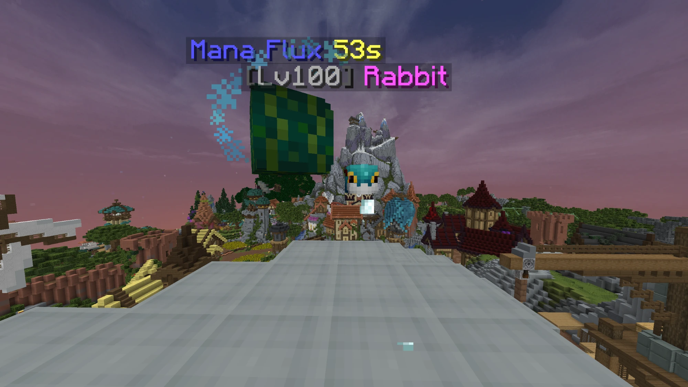

# SkyCosmetics

**Every Hypixel SkyBlock skin, dye, name and glint, on your own gear and pets.** Put any skin Hypixel has ever made
on your helmets, items and pets, dye any armor with any dye (animated ones included), rename items and restyle their
glint, and see it everywhere: in every menu, in your hand, on your player model and on your summoned pet.

Purely visual. SkyCosmetics only changes how things are drawn on your screen: it sends nothing to the server,
clicks nothing, and other players see Hypixel's items as usual.

> Formerly **Skin Studio**. Replace its jar with this one: your looks, settings and open key carry over on the first
> start.

## Features

- **Every skin.** Helmet skins with all their color variants (Knight Skin and its 15 shiny versions together),
  animated skins at Hypixel's real frame timing, every pet skin, every power orb skin and every head in SkyBlock.
  Paste any texture too.
- **Every dye, on any armor.** All static and animated Hypixel dyes, any hex color, or your own animated dye.
  Animated dyes ripple from boots to helmet like on Hypixel. Armor Hypixel makes from iron (Helianthus...) is shown as
  dyed leather so the color always shows.
- **Names.** Rename items with color codes (`&6Golden &lBlade`), a color picker, or a one-click gradient (Rainbow,
  Fire, Ocean...). Display only: other mods still see Hypixel's real name unless you turn on "Names in Other Mods".
- **Glint.** Turn the enchant glint on or off per item, and give it any color, speed and strength.
- **Pets and power orbs in the world.** Your summoned pet and your deployed power orb wear the skin you picked:
  Hypixel's own entity, reskinned. Nothing extra is spawned.
- **My Items.** Everything you wear and hold, your summoned pet, and every skinnable item the game has shown you
  (wardrobe, pets, ender chest, backpacks, personal vault) in one searchable list.
- **Favorites.** Right-click a skin or dye to star it; favorites are listed first.
- **No flicker.** A skin or animation frame is only swapped in once its texture has loaded.
- **Stays current.** New cosmetics arrive without a mod update: the catalog reloads when Skyblocker or Firmament update
  the community item repo, and skins the repo doesn't have yet are learned from items you see in game.
- **Light.** Items are identified once and cached, nothing heavy runs per frame, and saving happens in the
  background.

## How to use

- Open your inventory and click the small **brush** next to your player, or hover any item in any menu and press your
  **open key** (unbound at first: set it in the settings or in Controls), or type `/skycosmetics edit`.
- Pick an item on the left, then click a skin, dye or name on the right. It applies at once; there is nothing to save.
- **Reset** puts Hypixel's look back. The button above it switches between "This Item Only" and "Every item of this
  type".
- Right-click an item in the list to remove it (for example after selling it). The **Saved** tab lists everything you
  changed.

| Command | What it does |
|---|---|
| `/skycosmetics` | Opens the settings (the same screen as Mod Menu's Configure button). |
| `/skycosmetics edit` | Opens the editor for your held item (or your helmet). |
| `/skycosmetics debug pet`, `/skycosmetics debug orb` | Show what the pet and orb reskin see, for bug reports. |

## FAQ

**Is it safe to use on Hypixel?** It is purely visual: it only changes how items are drawn on your client. It sends no
packets, automates nothing and gives no gameplay advantage, the same kind of feature Skyblocker and SkyOcean offer. As
with any mod, you use it under Hypixel's rules on allowed modifications.

**Can other players see my looks?** No. Only you see them.

**Does it work with Skyblocker, SkyOcean and Firmament?** Yes. If you also customize the same item in another mod, the
two will fight: use one mod per item.

## Install

- Download the jar from [Releases](https://github.com/Terabold/SkyCosmetics/releases) and put it in your `mods`
  folder.
- Requires Minecraft 26.1.x with Fabric Loader 0.19.3+ and Fabric API.
- Optional: Mod Menu (a Configure button), Skyblocker or Firmament (SkyCosmetics reuses their copy of the item repo;
  without them it downloads the repo itself and refreshes it daily).

## Made with AI

SkyCosmetics' code is written by an AI assistant (Anthropic's Claude), directed and tested in game by the author. It
is disclosed here because players deserve to know. Bug reports and pull requests are welcome on the
[issue tracker](https://github.com/Terabold/SkyCosmetics/issues).

## Credits

Skin and dye data from the [NotEnoughUpdates repository](https://github.com/NotEnoughUpdates/NotEnoughUpdates-REPO).
Animation timing matches what SkyOcean and Skyblocker established.

Not affiliated with Hypixel Inc. or Mojang Studios.

## License

[MIT](LICENSE)
